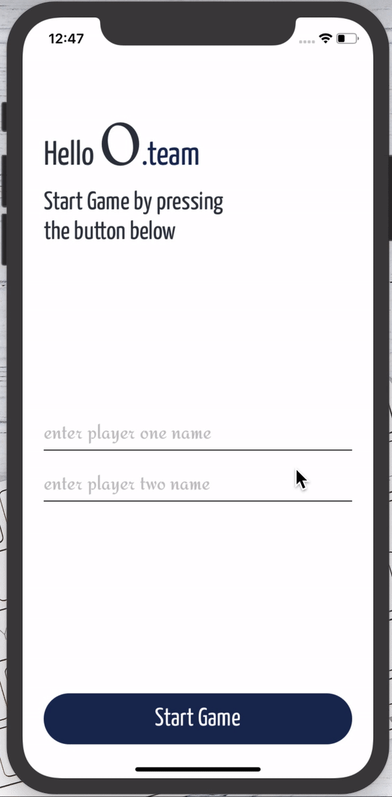

# tic-tac-toe [](https://app.circleci.com/pipelines/github/rajibola/tic-tac-toe)

## Preview

<span>

</span>

<hr />

## Getting Started

- Fork or Clone the repo, then set it up:

```
$ cd tic-tac-toc
$ yarn install
```

### Run on Android

```
$ yarn run android
```

### Run on iOS

```
$ cd ios && pod install
$ cd .. && yarn run ios
```

## A brief description of the project

### Task

> Build a Tic-Tac-Toe game that
> would allow two players sitting at the same computer to take turns making
> moves. The game should know when one player won the game and display a
> congratulations to that player. You can use whatever user experience works
> for you (it could be in the console or as a web-site or anything else), the
> important thing is the quality of the code. You can install any third-party
> dependencies you wish and use any online resources as long as they're not
> specific to building a Tic-Tac-Toe game.

## Solution

1. Player one and two input their names respectively.

2. Start button to take the user to an intro screen, where both player name are transitioned to the game screen.

3. When there is a winner it shows the winner(e.g Ridwan Wins!).

4. If there's no winner it shows draw.

5. Player have access to restart with another player or replay the game.

## Technologies Used

1. Implemented app navigation with `react-navigation`.

2. Added shared transition using `react-navigation-shared-element` to transition player name from intro screen to game screen.

3. Used hooks' context for storing players data and state.

4. Used `jest`,`react-test-renderer` and `testing-library/react-native` for component and unit test.

5. Used `circleci` for continuous integration.
